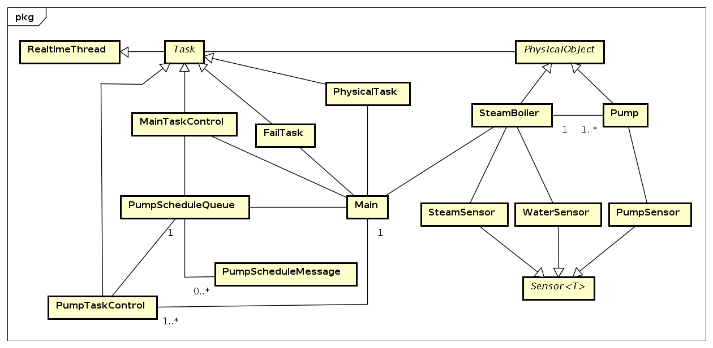
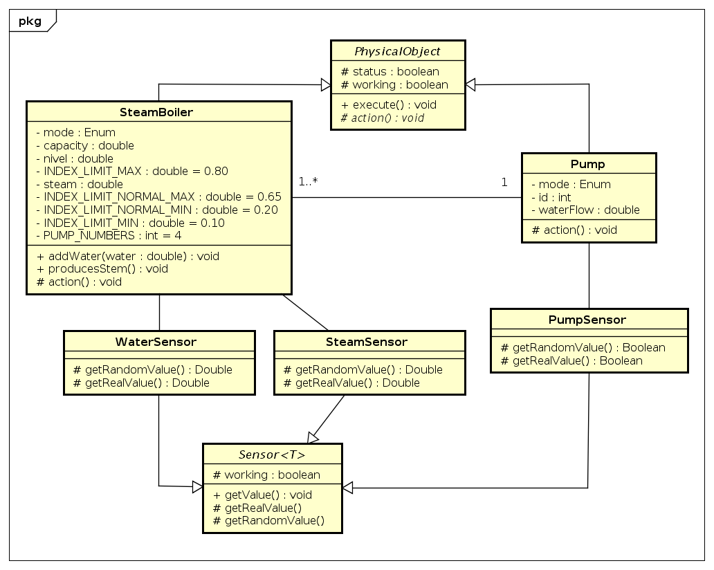
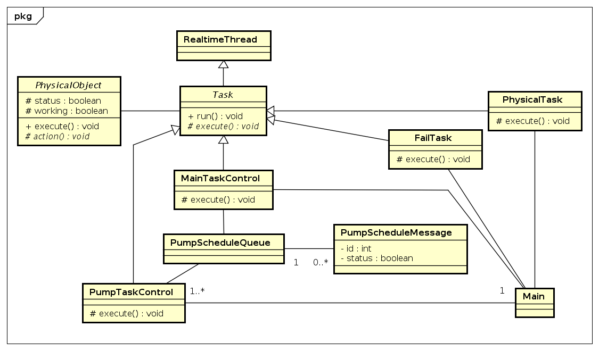

# Controle de uma caldeira a vapor utilizando RTSJ

STR - UFPEL (2016/1)

## Integrantes

* Dione Silveira da Silva (<dsdsilva@inf.ufpel.edu.br>)
* Luan Einhardt (<ldseinhardt@gmail.com>)

## Trabalho

### Tarefas

| #  | Nome                       | Inicio (s) | Período (s) | Prioridade | Tipo      |
| ---|--------------------------------------------------------------------------------|
| T1 | Simulação da planta física | 0          |  1          | 1          | Periódica |
| T2 | Controle principal         | 0          |  5          | 2          | Periódica |
| T3 | Controle da bomba 1        | 0          |  5          | 3          | Periódica |
| T4 | Controle da bomba 2        | 0          |  5          | 4          | Periódica |
| T5 | Controle da bomba 3        | 0          |  5          | 5          | Periódica |
| T6 | Controle da bomba 4        | 0          |  5          | 6          | Periódica |
| T7 | Simulação de falhas        | 0          | 10          | 7          | Periódica |

1. Simulação da planta física:
2. Controle principal:
3. Controle da bomba 1:
4. Controle da bomba 2:
5. Controle da bomba 3:
6. Controle da bomba 4:
7. Simulação de falhas:

### Diagrama de classes (visão geral)

### Diagrama de classes (visão objetos e sensores)

### Diagrama de classes (visão tarefas)

Implementação de RTSJ utilizada: Aicas - JamaicaVM v8 (https://www.aicas.com/cms/en/JamaicaVM)

## Anotações

Controle de uma caldeira a vapor (SteamBoilerCtrl)

Controlar a quantidade de agua na caldeira

#### Componentes (Físico)

* 1 Caldeira a vapor (SteamBoiler)
	* Nível de água
	* Limite mínimo, máximo
	* Limite mínimo, máximo (Normal)
	* Válvula de segurança (Valve)
* 1 Monitor para o nível de água na caldeira (WaterMeasure)
* 1 Monitor para o vapor que sai da caldeira (SteamMeasurement)
* 4 Bombas (Pump) (Quatro ou uma ???)
* 4 Monitores para verificar defeito nas bombas (PumpCtrl)

#### Ciclico

1. Recepção de mensagens das unidades físicas
2. Análise das informações recebidas
3. Transmissão dos comandos para unidades físicas

#### Modos de operação (5)

1. Inicialização: [-> 2, 3, 4, 5]
	* Verificar o nível de água
	* Verificar quantidade de vapor que sai da caldeira
	* Verificar possiveis problemas com as bombas
2. Normal: [-> 3, 4, 5]
	* Manter o nível de água entre o mínimo e máximo por meio das bombas
3. Degradado: [2 <-] [-> 4, 5]
	* Tenta manter o nível de água entre mínimo e máximo
4. Salvamento: [~1-5]
	* Tenta manter o nível de á gua mesmo com problema no dispositivo que mede a quantidade de água (Como ????)
5. Parada de emergência
	* Para o sistema (Notifica o meio externo)

#### Caldeira a vapor

* A válvula só serve para remover a água na inicialização da caldeira.
* A capacidade total (indicada em litros)
* ...

#### Monitor para o nível de agua na caldeira

* O nível de água na caldeira em litros

#### Monitor para o vapor que sai da caldeira

* A quantidade de vapor em (litros/sec)

#### Bomba

* Capacidade em (litros/sec)
* Modo (on/off)
* Inicialização: Leva 5 segundos para começar a despejar agua na caldeira
* Parada: Efeito instântaneo

#### Monitores para verificar defeito nas bombas

* Indica se esta ou não fluindo água na bomba (y/n)
